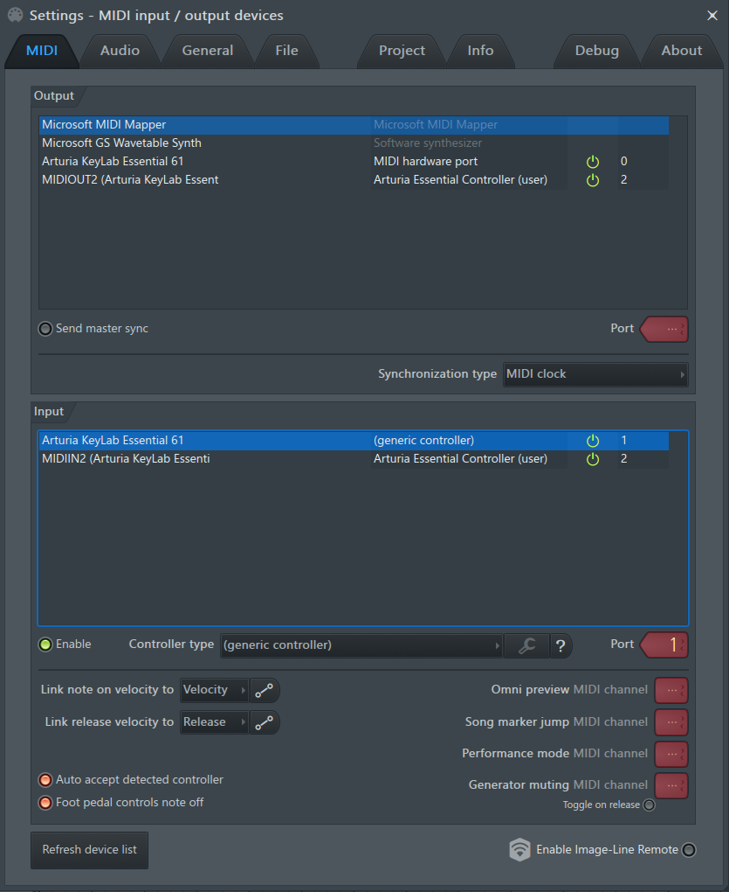

# Arturia Keylab Essential for FL Studio

This script is intended to allow using controls of Arturia Keylab Essential keyboard under FL Studio.
I've tested it with my own Arturia Essential 61. Should work with other keyboards of this line.

To use it you have to choose the DAW map on your keyboard. (Press Map Select + PAD 2)

First version. Simple but working. :-)

Any ideas about how to use other buttons are welcome.

## Howto

1. Download the script and unzip it. (Green button `Code` > Download ZIP) You will get a `ArturiaEssentialForFLStudio` directory.
2. Place this directory into `Documents\Image-Line\FL Studio\Settings\Hardware\` (default place. in some case you may have placed this directory elsewhere)
3. Set your Arturia Keylab Essential Keyboard to DAW mode by pressing `Map Select` then PAD 2.
4. In Fl Studio got to MIDI Settings. In input , at the line of `MIDIIN2 (Arturia Keylab Essential)`, set controller type to `Arturia Essential Controller (user)`

Et voilà. ;-)

You can click on `watch` on the upper right corner of this page to get advised on new releases.

Have fun and tell me what function I should add on wich button in next release.